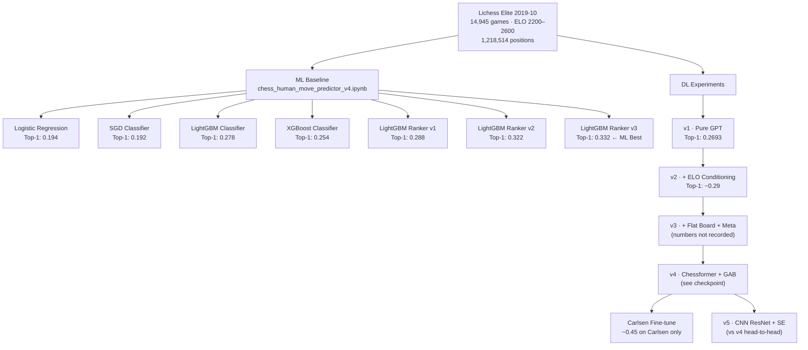
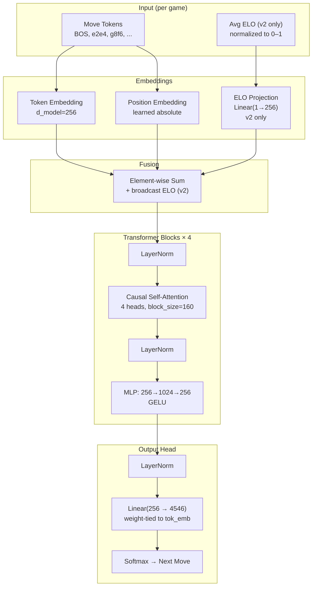
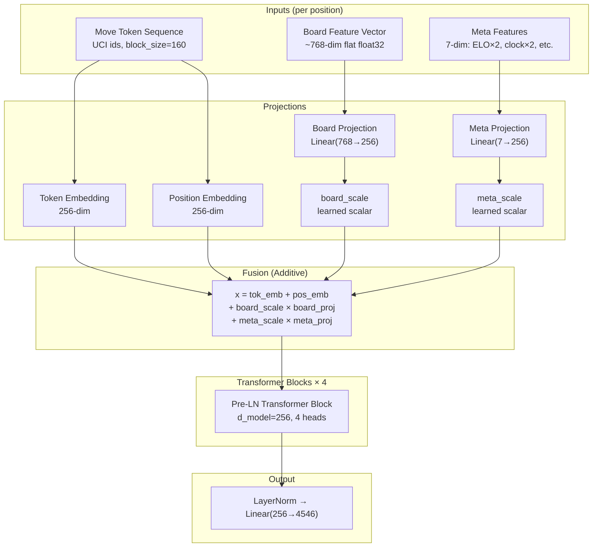
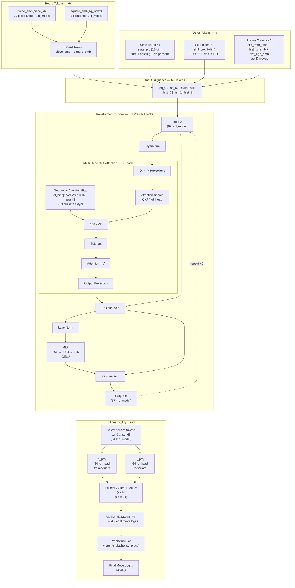
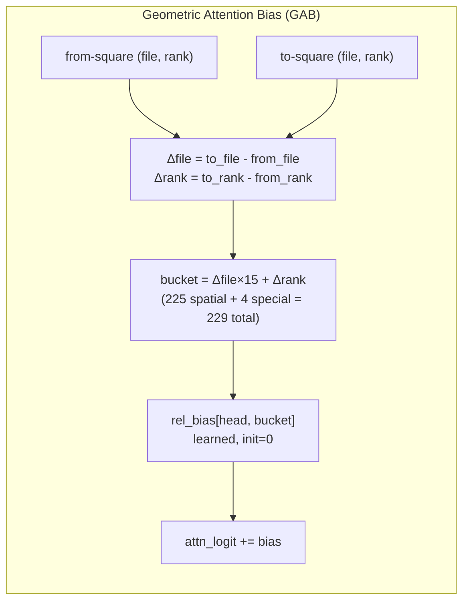
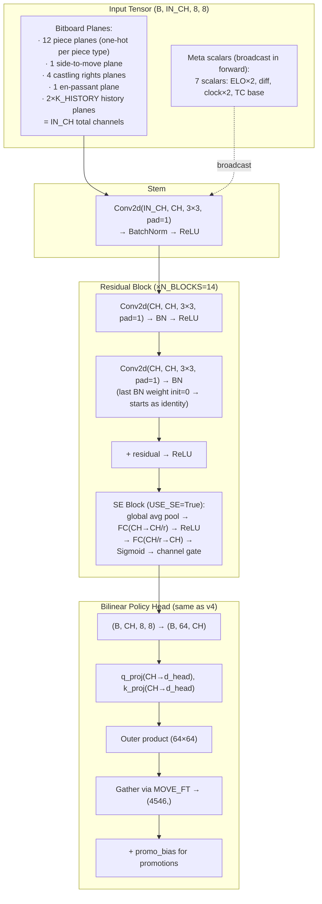
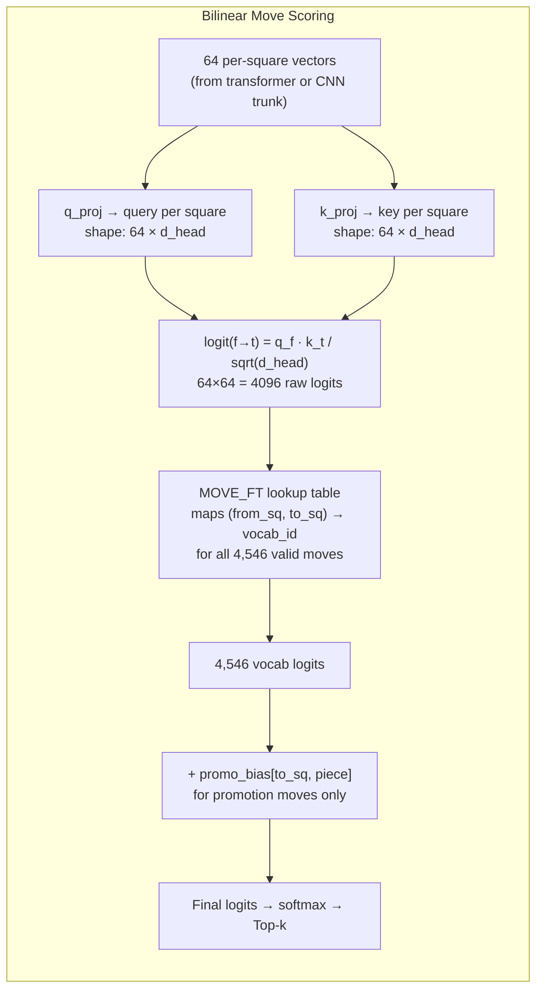
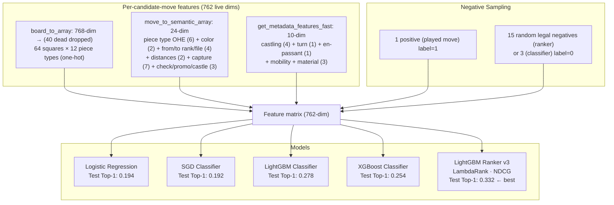
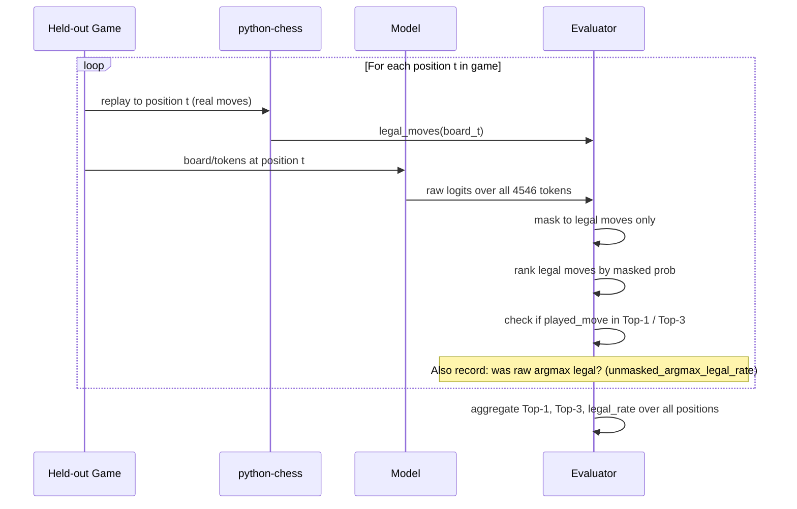

# Architecture Diagrams — ChessMoveNet-DL

Mermaid diagrams for every major architecture. Use these as visual references alongside the per-version docs.

---

## Overall Experiment Lineage

---

## v1 / v2 — GPT Architecture

---

## v3 — Transformer + Flat Board Features

> ⚠️ **v3 failure mode**: if `board_scale` >> `tok_emb`, board features dominate and the model ignores move sequence. Learned gains address but don't fully solve this; v4 uses separate tokens instead.

---

## v4 — Chessformer Architecture

### GAB Detail

---

## v5 — CNN Architecture

---

## Bilinear Policy Head (Shared: v4 + v5)

**Why bilinear?** A flat head needs `4546 × d_model` ≈ 1.17M params. Bilinear factorization costs `2 × d_model × d_head` ≈ 131k params and bakes in the knowledge that moves are (from-square, to-square) pairs.

---

## ML Baseline Architecture

---

## Evaluation Flow (Consistent Across All Models)

